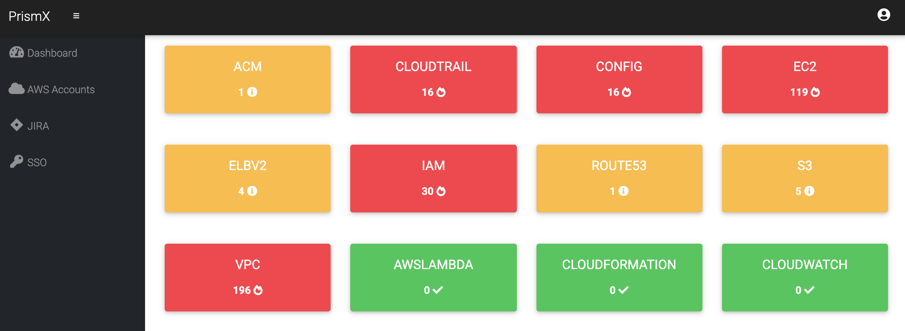

# PRISMX



### Summary
PrismX is a Cloud Security Dashboard, providing a single source of truth for cloud security issues based on AWS CIS Security Benchmarks. The dashboard provides a high-level overview for Executives as well as actionable data for Individual Contributors. 

The built-in JIRA integration allows users to quickly triage issues with pre-filled templates. Automated daily scans give you the latest insights on your cloud security posture.

### Tech Stack
- ScoutSuite
- Django
- Redis
- Celery

### Why not use ScoutSuite?
ScoutSuite is great. However, some organizations have dozens of AWS accounts, and ScoutSuite doesn't let you view all of your reports in a nice, high-level format. 

### Steps for Set Up
``` 
 1. pip3 install -r requirements.txt

 2. python3 manage.py migrate

 3. python3 manage.py makemigrations

 4. python3 manage.py runserver

 5. Login to http://127.0.0.1:8000

 6. python3 manage.py createsuperuser (enter username, email, password)

 8. celery -A app worker -l info

 9. celery -A app beat -l info

```

### Steps For Docker
```
docker build -t prismx .

docker run -p8000:8000 prismx
```

### To Do:
- Fix SSO (currently doesn't work through the Web UI)

Pull requests welcome!


### Video Preview

[](https://www.youtube.com/watch?v=KrGPffQn_QY)
